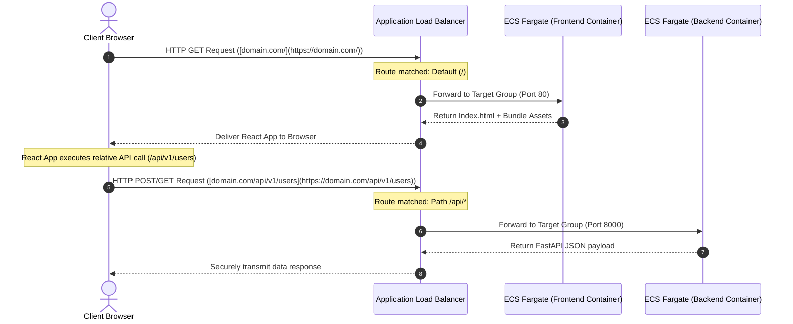
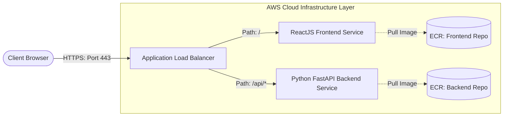
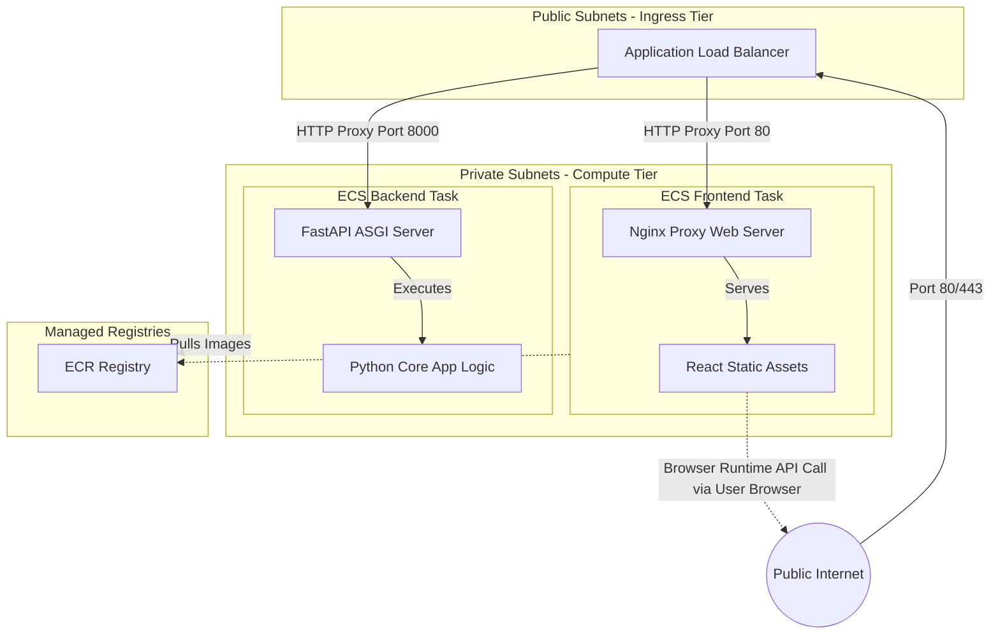
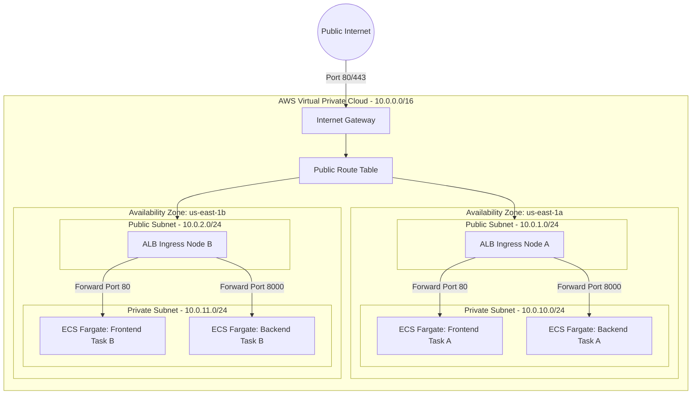
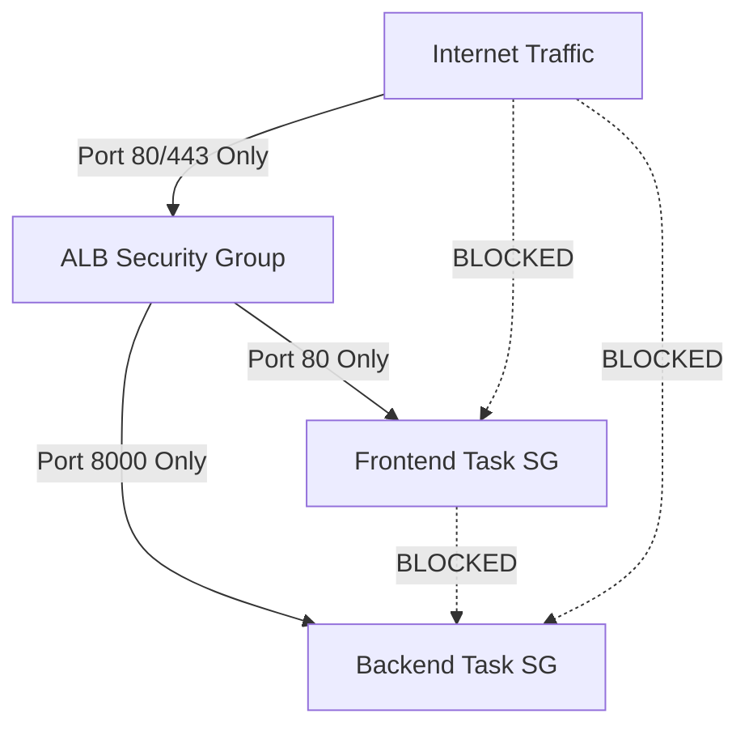

# System Topology Deep-Dive

This file contains the complete physical, structural, and behavioral diagrams detailing how our React + FastAPI architecture operates within AWS.

---

## 1. Ingress Sequencing Diagram

The following sequence highlights how an end-user client interacts with the frontend application assets and queries the backend data API.

## 2. System Context Diagram

The system context diagram illustrates how an external end-user interacts with the edge boundary of our AWS environment, and how traffic cleanly bridges into our virtual private network.

## 3. Component Diagram (Internal Layering and Interfaces)

This component layout models the decoupling of computing containers, interface boundaries, networking routes, and data ingestion targets inside the AWS VPC.

## 5. System Diagram (Multi-AZ)

This diagram details the architecture across two separate Availability Zones (AZs).

## 5. Operational Container Security Topology

Every ECS task layer operates with independent security group boundaries. 
Security groups attached to containers block all ingress ports by default 
unless explicitly sourced from the active Application Load Balancer's security group identifier.

